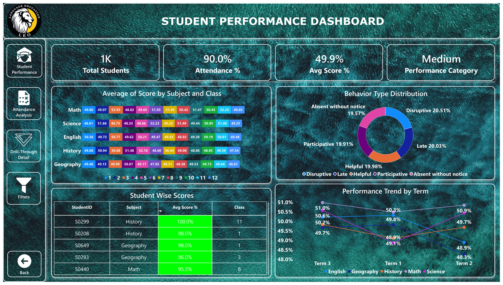
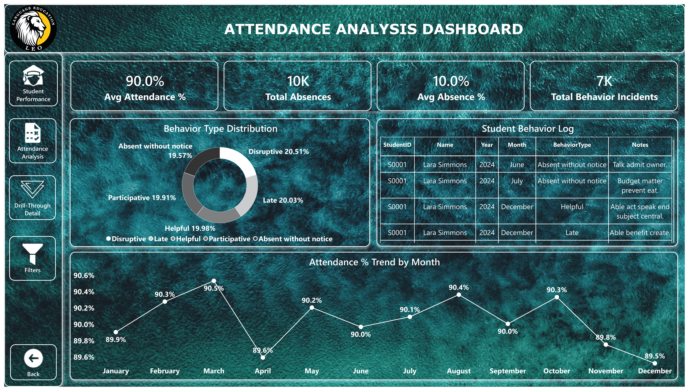
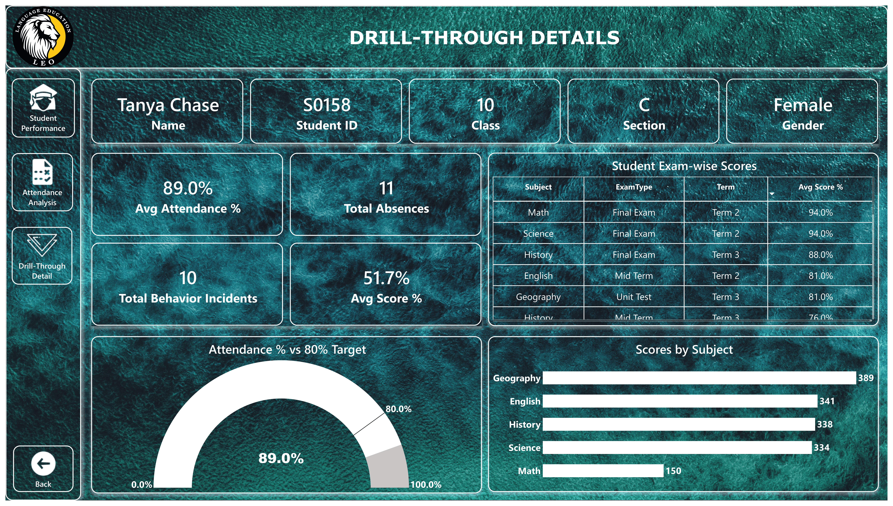
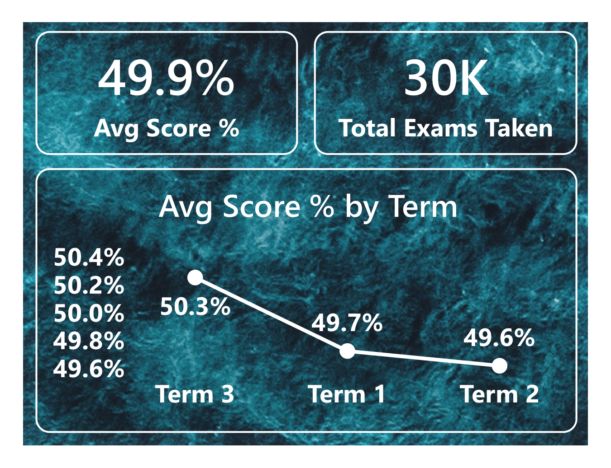

# 📊 Student Performance & Attendance Analytics Dashboard

> **Interactive Power BI dashboard for student performance, attendance, and behavioral analytics.**

[](https://powerbi.microsoft.com/)
[]()
[]()
[]()

---

## 🖥️ Dashboard Preview

### Student Performance


### Attendance Analysis


### Drill-Through Details


### Tooltip


---

## 📌 Project Overview

The **Student Performance & Attendance Analytics Dashboard** is an interactive Power BI solution built on four source tables — `Students`, `Scores`, `Attendance`, and `Behavior` — transforming raw student records into a consolidated academic and behavioral analytics report.

The model follows a **star schema**: `Students` sits as the central dimension table, related one-to-many to three fact tables (`Scores`, `Attendance`, `Behavior`) via `StudentID`, with a supporting `Date` table for time-based trending.

The report provides a consolidated view of:
- Student academic performance and subject-wise scores
- Attendance and absence patterns, trended by month
- Behavioral incident distribution
- Class and section-level comparisons
- Term-wise academic trends
- Individual student drill-through profiles

The dashboard uses interactive navigation, slicers, KPI cards, charts, tables, drill-through, custom tooltips, and toggle bookmarks to provide an intuitive analytical experience.

---

## 📑 Dashboard Pages

| Page | Purpose |
|---|---|
| **Navigation** | Landing page with global slicers (Subject, Section, Class, Term) and navigation buttons into the report |
| **Student Performance** | High-level view of student scores, attendance, behavior, and performance category across the school |
| **Attendance Analysis** | Focused view of attendance %, absence patterns, monthly attendance trend, and behavior incidents |
| **Drill-Through Details** | Individual student profile — identity, KPIs, attendance gauge, subject-wise score breakdown |
| **Tooltip** | Hover-triggered mini page showing exam count and score trend for the hovered data point |

---

## 🎯 Key KPIs (DAX Measures)

| Measure | Used on |
|---|---|
| **Total Students** | Student Performance |
| **Avg Score %** | Student Performance, Drill-Through, Tooltip |
| **Attendance %** | Student Performance (card), Drill-Through (gauge) |
| **Avg Attendance %** | Attendance Analysis, Drill-Through |
| **Total Absences** | Attendance Analysis, Drill-Through |
| **Avg Absence %** | Attendance Analysis |
| **Total Behavior Incidents** | Student Performance, Attendance Analysis, Drill-Through |
| **Total Exams Taken** | Tooltip |
| **Performance Category** | Student Performance (High / Medium / Low, via `SWITCH(TRUE(), ...)`) |

---

## 📊 Visual Analytics

### Navigation
The landing page for the report, providing global filtering and one-click navigation into the other pages.
- Slicers: **Subject**, **Section**, **Class**, **Term**
- Navigation buttons routing to Student Performance and Attendance Analysis

### Student Performance
Executive-level overview of academic outcomes across the school.
- KPI cards: **Total Students**, **Attendance %**, **Avg Score %**, **Performance Category**
- Bar chart: Average Score by **Subject**, split by **Class**
- Line chart: **Avg Score %** trend across **Term**, one line per **Subject**
- Donut chart: **Total Behavior Incidents** by **Behavior Type**
- Table: Student-wise scores (StudentID, Subject, Avg Score %, Class) with conditional formatting
- Slicers: Term, Class, Section, Subject

### Attendance Analysis
Focused view of attendance and absence patterns.
- KPI cards: **Avg Attendance %**, **Total Absences**, **Avg Absence %**, **Total Behavior Incidents**
- Line chart: **Avg Attendance %** trended by month (using the Date table)
- Donut chart: **Total Behavior Incidents** by **Behavior Type**
- Table: Student-level behavior log (StudentID, Name, Year, Month, Behavior Type, Notes)
- Slicers: Section, Term, Class, Subject

### Drill-Through Details
A detailed profile for a single student, reached via right-click → Drillthrough from any student row on the Student Performance table (filtered on `Students[StudentID]`).
- Identity card: **Name**, **StudentID**, **Class**, **Section**, **Gender**
- KPI cards: **Avg Attendance %**, **Total Absences**, **Total Behavior Incidents**, **Avg Score %**
- Gauge: **Attendance %** for the selected student
- Bar chart: Average score by Subject for the selected student
- Table: Exam-wise breakdown (Subject, ExamType, Term, Avg Score %)

### Tooltip
A compact custom tooltip page shown when hovering over score visuals on other pages.
- Card: **Total Exams Taken**
- Card: **Avg Score %**
- Mini line chart: **Avg Score %** by **Term**

---

## 🧠 DAX & Data Modeling

The dashboard uses a Power BI semantic model built as a star schema, with all measures centralized on a dedicated `_Measures` table for easy discovery.

**Model:**
- `Students` (dimension) — 1-to-many → `Scores`, `Attendance`, `Behavior` (fact tables), joined on `StudentID`
- `Date` table — supports the monthly attendance trend on the Attendance Analysis page

**Measures on `_Measures`:**
```DAX
Total Students
Avg Score %
Attendance %
Avg Attendance %
Total Absences
Avg Absence %
Total Behavior Incidents
Total Exams Taken
Performance Category
```

---

## 🧭 Interactivity

- **Slicers** on every analytical page: Class, Section, Subject, Term
- **Drillthrough** from the Student Performance table into a full student profile
- **Custom tooltip page** applied to score visuals for at-a-glance context on hover
- **Toggle bookmarks** for switching between visual states on the report, wired to on-canvas buttons

---

## 🛠️ Tools & Technologies

- **Power BI Desktop** — data modeling, DAX, report design
- **Power Query** — data cleaning and transformation
- **DAX** — measures for scores, attendance, and behavior analytics

---

## 📂 Repository Structure

```
├── Practical_Exam.pbix
├── Dataset         
├── Images/                      
│   ├── Student-Performance.png
│   ├── Attendance-Analysis.png
│   └── Drill-Through-Details.png
└── README.md
```

---

## 🚀 How to Use

1. Clone or download this repository
2. Open `Practical_Exam.pbix` in **Power BI Desktop**
3. Use the slicers on any page to filter by Class, Section, Subject, or Term
4. Right-click any student row on the **Student Performance** table → **Drillthrough** → **Drill-Through Details** for an individual profile
5. Hover over score visuals to see the custom tooltip

---

## 📈 Insights Derived

- Score performance can be compared side-by-side across subjects and classes to spot consistently under-performing groups
- The monthly attendance trend surfaces seasonal dips that a single overall attendance % would hide
- Cross-referencing the behavior donut against attendance KPIs highlights whether behavioral incidents cluster with attendance issues
- The Performance Category (High / Medium / Low) gives a fast triage view for identifying students who need academic support

---

---
## 👤 Author

**Pratik Patil**

Power BI • Data Analytics • Business Intelligence

---

## ⭐ If You Find This Project Useful

If you like this dashboard or find it useful for learning Power BI and data analytics, consider giving the repository a ⭐.

---
